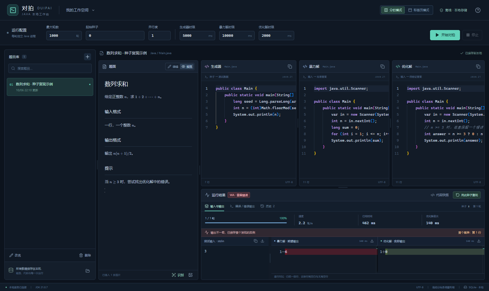
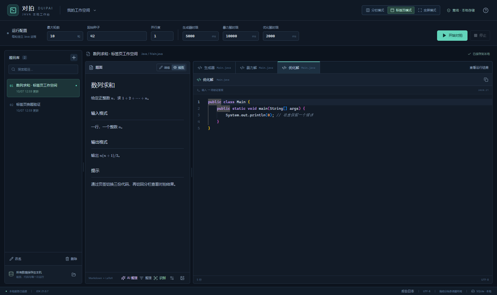
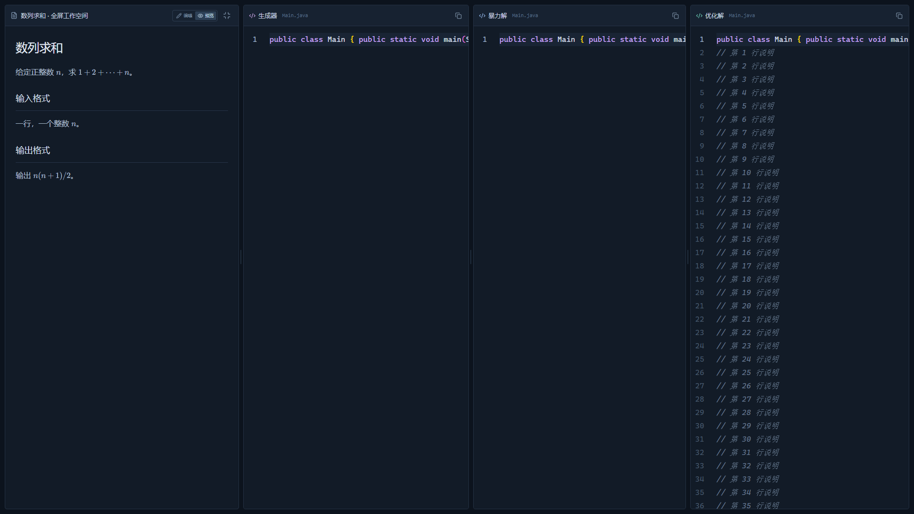

# 对拍工作台

面向 Windows 10/11 的本地 Java 对拍桌面应用。支持三栏编辑器与结果同屏，也可使用单编辑器标签页模式。支持截图粘贴与拖入、LaTeX、可保存的拖动分栏、批量对拍、停止、反例 Diff、种子复现和历史快照。

技术栈：Electron、React、TypeScript、Monaco、KaTeX；Spring Boot、MyBatis、SQLite；JDK 21。

## 运行桌面版本

需要本机安装完整 **JDK 21**，并设置 `JAVA_HOME` 或使 `java` 与 `javac` 位于 PATH。后端和用户代码共用此 JDK。应用界面、编辑器与对拍资源全部本地打包；可选的 AI 整理连接你配置的服务。

构建出的便携程序为 `release/Duipai-1.0.5-win-x64.exe`，双击打开。未进行商业代码签名。数据默认保存在 `%APPDATA%/duipai-workbench/data`；状态栏可打开数据目录。退出应用后复制整个目录即可备份。

可设置 `DUIPAI_JAVA_HOME` 指定 JDK，`DUIPAI_DATA_DIR` 指定数据目录。种子为 signed 64-bit 十进制整数，留空则随机。

此前使用项目 `data` 目录的用户，可先关闭旧窗口，再双击项目根目录的 `启动工作台.cmd`。它启动新版便携程序并继续使用当前项目数据和配置目录。

## 从源码开发

需要 Node.js 22.12+、npm、Maven 3.9+ 和 JDK 21。

```powershell
npm run setup
npm run build
npm start
```

`npm run dev` 重新构建并启动桌面工作台。开发数据保存在项目 `data` 目录，缓存位于 `.cache`。前端独立开发可设置 `DUIPAI_BACKEND_URL` 和 `DUIPAI_TOKEN`，然后执行 `npm --prefix frontend run dev`；后端同时需设置 `DUIPAI_DEV_ORIGIN=http://127.0.0.1:5173`。

```powershell
npm test                 # TypeScript + 前端构建 + 后端 JUnit 测试
npm run test:acceptance   # 使用真实 JVM/SQLite 的完整后端验收
npm run test:desktop      # Electron 界面、关闭与重启测试
npm run test:portable     # 实际便携 EXE 启动、对拍与退出验收
npm run test:images       # 文件选择插图、尺寸适配、取消与超时回归
npm run test:recognition  # 真实 Windows OCR、分区映射替换与保存恢复
npm run test:ai           # OpenAI 兼容本地模拟接口、Key 配置、整理预览与保存恢复
npm run test:layouts      # 双显示模式、编辑状态保留及重启恢复
npm run test:fullscreen   # 原生全屏、界面精简、字体与编辑状态保留
npm run package          # 构建 Windows x64 便携程序
```

首次安装依赖和打包工具需要网络；本地对拍、图片识别和文字整理无需网络，使用 AI 整理时需要连接所配置的服务。`npm run package:dir` 生成可直接运行的目录版。

## 使用

1. 新建题目，输入题面或粘贴截图。新题自带可运行的三份 `public class Main` 模板，生成器从 `args[0]` 读取种子。
2. 设置最大轮数（默认 1000）、起始种子和并行度。三个时限分别默认 5 / 10 / 2 秒。
3. 开始对拍。任务开始前保存当前题面、代码和参数；停止输入 1 秒后也会自动保存。
4. 找到反例后查看种子、输入、两边输出差异及错误详情。修改代码后点击复现，验证同一轮是否已修复。
5. 历史记录可查看当时的反例与代码快照，再用当前代码复现。

右上角可切换“分栏模式”和“标签页模式”。分栏模式同时显示三个编辑器与下方运行结果；标签页模式仅显示一个编辑器，通过“生成器 / 暴力解 / 优化解”页签切换，隐藏下方结果。模式切换保留代码、光标、滚动和撤销记录，重启恢复上次选择的模式、页签和分栏尺寸。标签页模式下仍可开始、停止对拍；切回分栏模式查看结果。

1.0.5 新增右上角“全屏模式”，也可按 F11 进入。全屏下仅显示当前题目与编辑器，隐藏题目库、运行配置、结果、状态栏和辅助工具；题面和代码正文从 12px 放大到 16px。保留当前的分栏或标签页布局，题面仍可编辑，代码继续自动保存，支持 Ctrl+S。按 Esc、F11 或题面右上角的退出按钮返回，恢复原布局与字体，保留代码、光标和撤销记录。

点击题面底部的图片按钮选择 PNG/JPEG/GIF，保存完成后直接显示预览。点击图片打开大图：窗口根据原图分辨率调整，大图按比例缩小到屏幕内，小图保持原始大小；可切换“原始尺寸”滚动查看。上传支持取消，无响应时 30 秒超时并恢复按钮。更新后请关闭旧窗口再重新启动，现有题目和图片保留在原数据目录。

点击题面底部的「识别」可把截图转换为文字。已有图片时选择需要识别的截图；没有图片时直接选择文件。识别结果按题目描述、输入格式、输出格式、测试样例、数据范围、提示等区域映射，并在原图上显示对应位置。可以校正文字、调整区域映射、取消不需要的区域，再点击「应用到题面」，替换已有同类文字区域并添加缺少的区域。原图和其他笔记保留，结果自动保存；应用后可点击撤销按钮恢复本次替换前的题面。

识别使用 Windows 10/11 自带的本地 OCR，不上传图片到外部服务。支持本机已安装的识别语言，自动选择优先中文；缺少语言时会显示安装提示。多张图片按题面中的顺序识别和合并。数学公式、上下标、复杂排版和样例数字可能需要手动校对。

题面底部的「整理」可以修复已识别内容的间距与换行。有原图时自动重新识别，排除考试信息、代码栏、行号和水印，并将样例输入、输出和解释分开；没有原图时直接整理文字段落。应用结果保留原图与独立笔记，可撤销。示例见 [数字消除游戏](docs/数字消除游戏.md)。

题面底部新增「AI 整理」和「AI 设置」。先填写 OpenAI 兼容服务的 API 地址、模型名称和 API Key，保存后点击「AI 整理 → 开始整理」。界面会显示发送文字及按区域划分的可编辑结果，可修正题意、输入输出、样例和数据范围，再勾选需要替换的区域并应用。识别窗口中也可继续用 AI 整理识别草稿。原图、独立笔记和编辑器程序保留；应用可撤销并自动保存。Key 使用当前 Windows 账户加密，界面不回显，留空保存会保留旧 Key。发送文字由你在预览窗口校对；只有开始整理或显式连接测试会请求配置的外部服务。详见 [AI 整理说明](docs/AI.md)。

1.0.4 的 AI 调用使用流式接收；连接 DeepSeek 官方服务时自动关闭思考，适用于整理而无需解题的任务。等待时显示已耗时、首响应和接收字数，「处理记录」显示阶段与错误；失败和取消后可以重新整理。窗口中的「查看后台日志」或工作台底部「后台日志」打开数据目录的 `backend.log`，其中记录请求编号、HTTP 状态和阶段耗时，不记录 Key、题面、回复正文或推理内容。完整题面的耗时随长度、网络和服务负载变化。

开发构建输出位于 `.cache/backend-build`。每次启动都会将后端复制到独立运行目录，因此再次构建不会替换运行中的 JAR。

并行任务取最先检测到的失败，不保证其种子是所有轮次中最小的失败种子。每个程序每轮新启一个 JVM；时限包含 JVM 启动。Java 堆最大 128 MiB，stdout 捕获上限 8 MiB，stderr 上限 1 MiB。单块内容在界面显示前 1 MiB，可导出全部已捕获内容。超出执行上限的输出不继续保留。

本工具用于自己信任的本地 Java 代码，不包含操作系统沙箱。v1 范围只支持 Java、普通逐行答案比较；不含 SPJ、浮点容差、交互题或多用户功能。AI 整理为可选功能，不影响本地对拍。

完整 [设计说明](docs/DESIGN.md)、[接口协议](docs/CONTRACT.md)、[22 项需求验收记录](docs/ACCEPTANCE.md) 与 [图片题目识别说明及验收](docs/RECOGNITION.md) 位于 docs。






