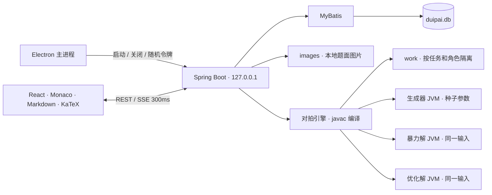

# 对拍工作台设计

## 使用流程

新建题目，粘贴 Markdown 题面或截图，编辑生成器、暴力解与优化解，设置轮数、种子、并行度和三份程序各自的时限，然后开始对拍。遇到首个已完成的失败轮次即停止其余并行轮次。结果保留种子、输入、输出、首处差异、运行耗时和错误栈；修改当前代码后可复现该种子。历史记录中的代码快照保留运行时版本。

## 架构

后端和用户程序使用同一 JDK 21。用户代码通过 `javax.tools.JavaCompiler` 在后端进程内编译，禁止注解处理器；每轮、每角色重新启动独立 Java 进程，使用 stdin/stdout 管道传数据。运行线程与界面线程分离。

## 数据与备份

题目包含标题、题面、三份代码、运行参数和更新时间。运行记录包含完整代码和参数快照、编译诊断、结果、反例和各程序元数据。SQLite 保存结构化数据与运行 JSON；图片单独保存在 `images`；源码和编译产物位于 `work`；分栏尺寸单独保存。退出应用后复制整个数据目录即可备份；新版本仍使用同一数据目录。

种子在 HTTP 和前端始终使用十进制字符串，后端使用 signed long，避免 JavaScript 大整数失真。随机起始种子在开始任务时生成，轮次 i 从 0 起，种子为 startSeed+i，超出 long 范围拒绝启动。

## 判定与资源限制

依次执行生成器、暴力解和优化解。生成器或暴力解异常、超时、输出超限均提示“裁判或数据有问题”；优化解区分 WA、RE、TLE、OLE。三份代码有任意编译错误时不执行轮次。

按行比对，只忽略每行行尾空白、文件末尾空行及 CRLF/LF 差异；保留行首、行内空白和其他字符。差异显示基于相同规范化规则。

每个子 JVM 使用最大 128 MiB Java 堆。每个程序 stdout 最多 8 MiB、stderr 最多 1 MiB，达到上限时终止程序并标记输出超限；后台连续读取管道，避免输出阻塞或无界内存增长。界面单块显示上限 1 MiB，可导出已捕获的完整内容；超出执行上限的部分不保留。时限包括子 JVM 启动与执行的墙钟时间。该版本运行用户信任的本地代码，没有操作系统沙箱。

Windows Job Object 为每个用户程序管理整个派生进程树。父程序快速退出、超时、输出超限、用户取消或后端退出时都会关闭 Job 并清理其余进程。用户进程环境移除应用令牌及可能绕过 JVM 限制的环境参数。

本机 Windows 11 / JDK 21.0.7 实测 120 轮，每轮生成器和两个解法都是新 JVM：1 并行 5.29 轮/s，4 并行 16.04 轮/s（均含编译时间）。默认并行度 4 达到需求目标；具体速度随机器和代码变化。

## 桌面生命周期与访问控制

Electron 每次生成独立 256-bit 令牌，只通过子进程环境和 HttpOnly/SameSite Cookie 交付。后端仅监听 127.0.0.1 的随机端口。所有 API、图片、SSE、导出和关闭接口均验证令牌；来源校验只接受同源或显式开发来源。

关闭窗口先等待前端强制保存，然后通知后端取消任务、清理所有已跟踪子进程并关闭。若保存失败，窗口保留并提示。后端监视 Electron 的父进程 PID，异常结束后也会清理任务。正常关闭失败时桌面端在短暂等待后终止后端进程树。

1.0.1 启动时将后端 JAR 复制到用户配置目录下的独立 `backend-runtime/run-*` 目录，Java 始终读取该运行副本；退出后清理副本。开发构建使用 `.cache/backend-build`，避免重建覆盖运行中的嵌套依赖。图片上传有 30 秒超时和取消能力，完成后插入本地 Markdown 引用。点击图片打开按原始分辨率和当前可用窗口空间计算的预览，保持比例，支持原始尺寸滚动查看。

Renderer 启用 contextIsolation、sandbox，关闭 Node 集成，IPC 只暴露版本信息、打开数据目录和关闭前保存三个能力。网页、编辑器 worker、字体和公式资源都随应用打包，运行不访问 CDN。

## 布局

上方运行工具栏；下方横向分为题目列表、题面和编辑/结果工作区。工作区纵向分为三个横排编辑器和结果面板。每条分隔线支持鼠标拖动与方向键，修改后保存并在启动时恢复。题面编辑和预览切换，结果提供输入、输出差异、错误详情与历史记录。

## 开发参考

- [Electron 安全建议](https://www.electronjs.org/docs/latest/tutorial/security)
- [Electron Cookie API](https://www.electronjs.org/docs/latest/api/cookies)
- [electron-builder Windows 打包](https://www.electron.build/v26/docs/win/)
- [Java 21 Process API](https://docs.oracle.com/en/java/javase/21/docs/api/java.base/java/lang/Process.html)

需求来源：用户提供的《需求文档.pdf》（2026-10-06）与两张架构/布局草图。
