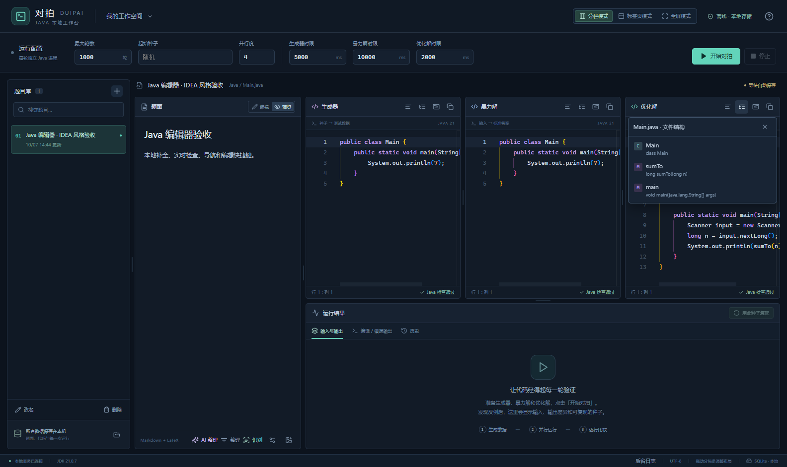

# Java 编辑器 · 1.0.6

编辑器使用本地 JDK 21 的编译器分析每个 Main.java，提供 IDEA 风格的核心编辑操作。三份代码分别分析，不会把另一个编辑器中的类或变量混入提示。

- 停止输入约 700ms 后检查错误和警告；点击底部问题数量展开列表，点击问题定位。标签页显示隐藏文件的错误数量。
- 输入 `.` 或按 Ctrl+Space，按接收者类型补全 JDK、当前文件的方法和字段。保留方法重载，泛型成员使用实际类型；在标识符中间接受补全也会替换整个标识符。
- 选择常用 JDK 类会自动补充 import；未导入的常用类可以使用 Alt+Enter 修复。显式导入、通配符导入和名称冲突都会影响导入操作。
- 悬停查看符号信息，Ctrl+B / F12 跳转当前文件中的定义，Ctrl+P 查看调用的参数及重载。
- 右上角的结构按钮列出类、字段和方法，点击跳转。开启括号颜色、作用域缩进线和顶部固定作用域。
- Java 模板包括 `psvm` / `main`、`sout`、`soutv`、`serr`、`fori`、`iter`、`fastio`；Tab 在占位符之间切换。`fastio` 在类中插入缓冲输入的 FastScanner。

| 快捷键 | 操作 |
| --- | --- |
| Ctrl+Space | 代码补全 |
| Alt+Enter | 导入修复 |
| Ctrl+Alt+L | 整理缩进 |
| Ctrl+B / F12 | 跳转到当前文件定义 |
| Ctrl+P | 参数提示 |
| Ctrl+F12 | 文件结构 |
| Ctrl+D | 复制当前行或所选行 |
| Ctrl+Y | 删除当前行或所选行 |
| Ctrl+Shift+Z | 重做 |
| Ctrl+/ | 切换行注释 |
| F2 / Shift+F2 | 当前文件的下一个或上一个问题 |
| Ctrl+F / Ctrl+H | 查找或替换 |

缩进整理保留语句和字符串内容，不重排语句或导入；文本块及多行注释的内容和换行保持原样。导入、模板、缩进和行操作均可撤销，模式和全屏切换保留三个 Monaco 实例、光标及撤销记录。

分析仅处理当前文件与 JDK 标准库，不执行代码，不生成 class 文件，不运行注解处理器，也不调用 AI。源码上限为 200000 个 UTF-16 单元；编译器最多同时处理两份请求。前端取消旧请求并校验版本，过期结果不会覆盖新代码。分析不可用时保留模板与关键词提示，继续编辑会重新检查。

当前范围不含 IDEA 的跨文件项目索引、重命名重构、断点调试和完整代码风格格式化。

验证记录：前端 91 项、后端 75 项通过；Java 新增前端 19 项及后端 12 项均通过。真实 Electron Java 编辑交互 [12 项通过](editor-results.json)，[标签页 9 项](layout-results.json)及[全屏 6 项](fullscreen-results.json)回归通过；截图如下。便携程序验证见 [portable-results.json](portable-results.json)。

