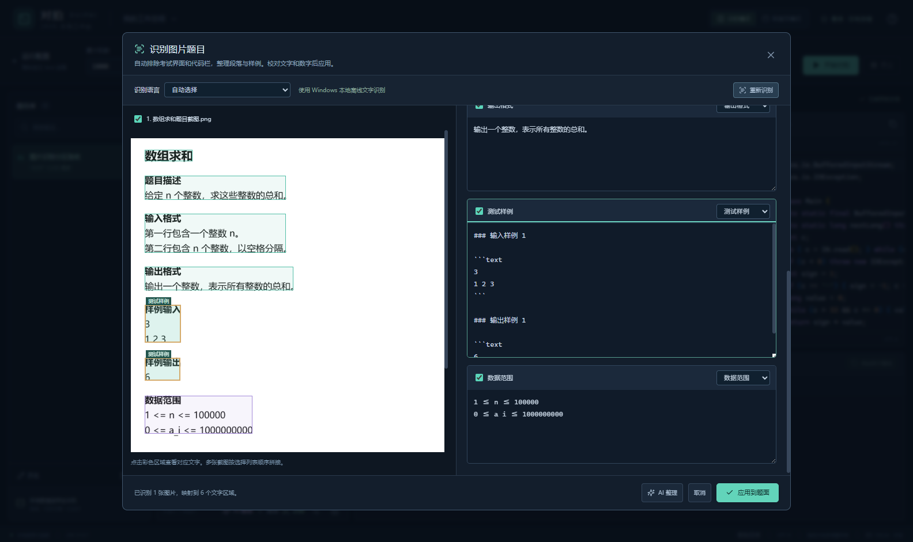

# 图片题目识别与文字区域映射

点击题面底部「识别」，选择已有截图或直接添加图片，点击「开始识别」。识别结果按题目标题、题目描述、输入格式、输出格式、测试样例、数据范围、提示与说明分区。左侧原图标出对应区域，右侧可以校正文字、调整区域类型和取消勾选。

点击「应用到题面」后，选中区域替换已有同类 Markdown 内容；没有对应区域时添加新段落。未选中区域、独立笔记区和原图引用保留。结果沿用题面的自动保存流程；应用后可以撤销本次替换。题目库名称不会随图片中的标题改变。

使用 Windows 10/11 自带 OCR，图片只在本机处理，无需账户或联网。语言选项来自本机已安装的 OCR 语言组件，自动选择优先简体中文、繁体中文、英文。数学公式、上下标、字体相近的字和数字需要对照原图校对。

多图按题面中的图片顺序合并，支持中英区域标题、编号样例、横排输入输出和并排样例。识别保存原图像素坐标。对于带样例标题的图片，使用同一语言以另一尺寸补识别，仅补充样例区中没有重叠的数字行，保留首次识别结果。

「整理」用于改善旧 OCR 结果：有原图时自动开始识别并打开同一校对窗口，无图时整理文字段落。考试截图通过重复的区域标题与右侧代码列定位题目栏，剔除侧栏、顶部考试信息、编辑器行号和按钮；只对定位到的题目栏做局部对比度处理，支持深色背景，坐标仍映射回原图。完整的输入范围、时间与内存限制优先保留未经图像处理的首次识别结果，减少对比度处理遗漏数字的影响。

正文合并截图中的物理折行，完整句子、输入说明与操作步骤分段；样例输入和输出各自使用代码块，解释使用普通段落，输入中的显式数据范围拆为独立区域。替换旧样例时去掉初始模板的编辑器/生成器说明，保留个人笔记和用户单独填写的生成器说明。整理后的实际题目示例：[数字消除游戏](数字消除游戏.md)。

1.0.2 整理版（2026-10-06）验证记录：

| 验证 | 结果 | 证据 |
| --- | --- | --- |
| 前端单元测试 | 53/53 通过 | 分区解析与合并、考试栏过滤、段落换行、原始数字保留、笔记与样例数据保护、超时及取消 |
| 后端单元与集成测试 | 30/30 通过 | 含 8 项 OCR 测试，深色题目栏对比度、局部与超宽图坐标、区域边界、真实截图样例数字、路径校验和并发限制 |
| 真实 Electron + Windows OCR | 13/13 通过 | [1.0.2 验收报告](recognition-1.0.2-results.json)：识别、映射、校对、勾选、撤销、原图和笔记、取消与错误、重启保存、整理入口及实际考试截图 |

1.0.3 新增可选 [AI 整理](AI.md)，1.0.4 增加真实进度、耗时和后台日志入口，并清除失败时残留的“正在处理”提示。本次前端 72/72、后端 63/63 测试通过；真实 Electron + Windows OCR 基础回归 12/12 通过，见 [当前验收报告](recognition-results.json)。此前实际考试截图的现场验证保留在 1.0.2 报告中。识别草稿可以继续用 AI 整理，未选择的草稿区域、原图坐标和勾选状态保留；这条流程由 AI 专项桌面验收覆盖。

TypeScript 与 Vite 构建通过。最终 Windows 便携程序的实际验收见 [portable-results.json](portable-results.json)。

